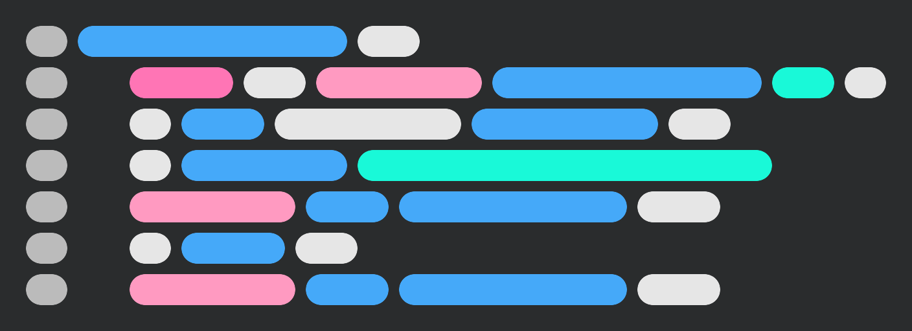
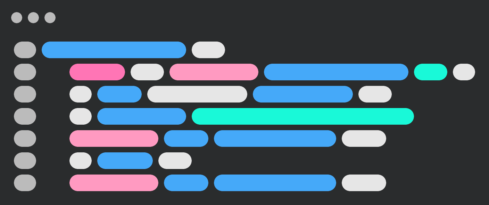

# Blobbed Editor

<div align="center">

[](https://blobbededitor.vercel.app/)

</div>

*Create blobbed, syntax-highlighted images of your code.*

## What It Does

[Blobbed Editor](https://blobbededitor.vercel.app/) turns your code into highlighted, blobbed images using [Highlight.js](https://github.com/highlightjs/highlight.js) and [html2canvas](https://github.com/niklasvh/html2canvas). Examples of the generated images can be found below or in the [images](/images) folder.

## Examples

Blobbed editor can generate 3 different types of images and each can be customized with a variety of settings.

The code used to generate these images is as follows.

```javascript
downloadImage() {
  const a = document.createElement("a");
  a.href = canvas.toDataURL();
  a.download = "blobbed editor.png";  
  document.body.appendChild(a);
  a.click();
  document.body.removeChild(a);
```

> Some settings are changed from the default including image size, filter smaller blobs (which is why the closing `}` tag was left out) and editor padding.

### Regular



### App Icon


> When generating app icons I would recomend to keep the lines brief like the [logo](images/regular.png)

### Window



## What Can I Use It For?

- Favicons
- Logos
- Profile Pictures
- App Icons
- Replacement For Stock Photos
